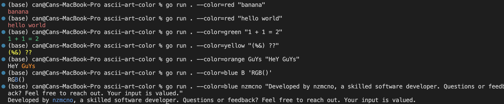

# ascii-art-color

## Colored Text Printer

This is a simple command-line utility written in Go that allows you to print colored text to the terminal. You can specify the text color and the text itself as command-line arguments.

## Usage:

To use the program, run the following command in your terminal:

```bash
go run main.go --color=colorname "Your text here"
```

Replace colorname with the desired color (e.g., Red, Blue, Green, etc.) and "Your text here" with the text you want to print.

You can also specify a substring within the text that you want to highlight with a different color:

```bash
go run main.go --color=colorname substring "Your text here"
```

## Supported Colors:

The following color names are supported:

- Black
- Red
- Green
- Yellow
- Blue
- Magenta
- Cyan
- LightGray
- Gray
- LightRed
- LightGreen
- LightYellow
- LightBlue
- LightMagenta
- LightCyan
- White
- Orange

Examples:

Print "Hello" in red:

```bash
go run main.go --color=Red "Hello"
```

Highlight "world" within "Hello, world!" in blue:

```bash
go run main.go --color=Blue world "Hello, world!"
```



Running Tests:

Tests for the program are provided in the main_test.go file. To run the tests, execute the following command in your terminal:

go test

License:

This project is licensed under the MIT License (LICENSE).
